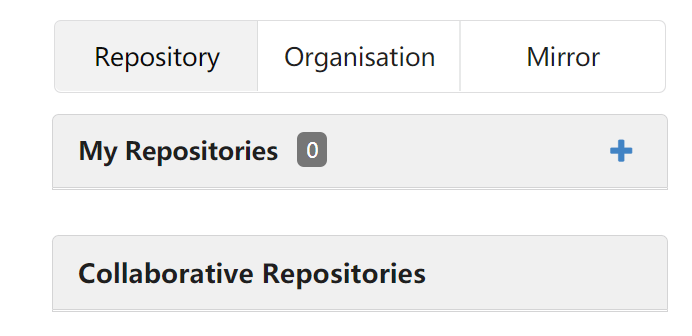
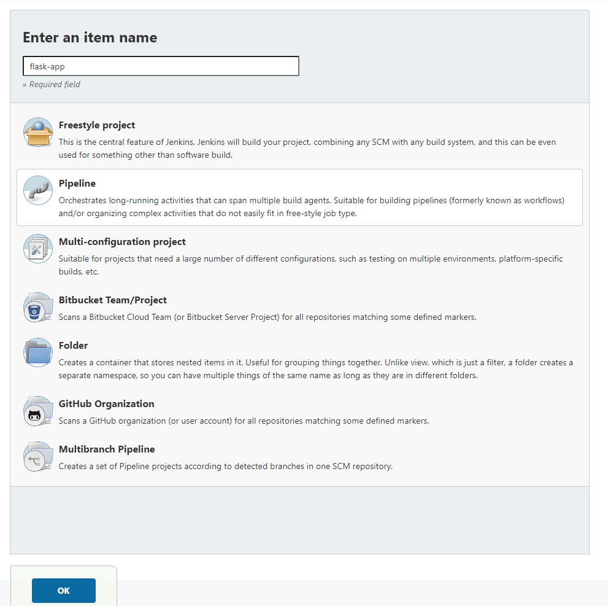
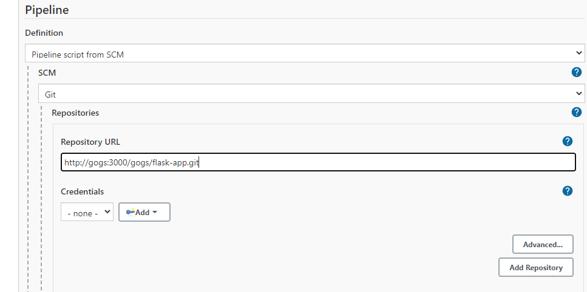
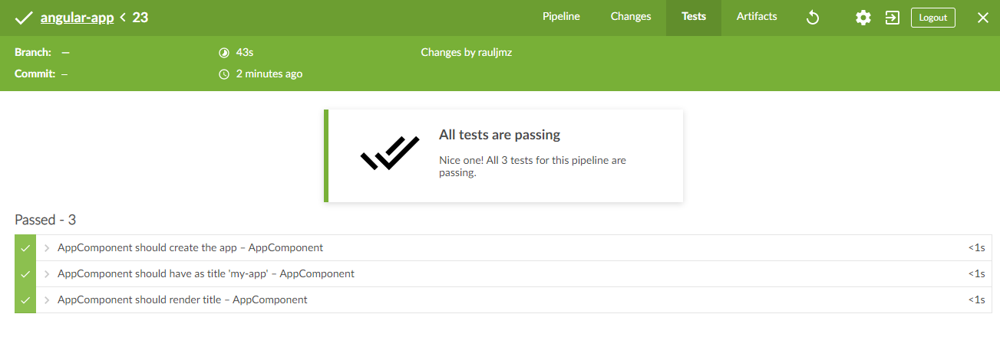

# Exercise 12: Pipelines

In this exercise you will configure a continuous integration pipeline. The purpose is: build an image with your code, test it, and then push it to a registry. 

## 12.1 Building a Python app

To do this you will use an automation tool for executing pipelines named [Jenkins](https://www.jenkins.io/). Since this is a Docker course, we are going to run everything using Docker.

### Start and configure tools

Navigate to the `exercise-12/jenkins/jenkins-runner`. You will see there is a docker compose file; start all the services running `docker compose up -d`. As you can see in the file this defines various services, including a Jenkins server, a Docker registry and a local GitHub. 

#### Push repository to Git

1. Open Gogs in the browser on http://localhost:3000. This will open the configuration page
1. Change the database typ to **SQLite3**
1. Click **Install Gogs** at the bottom of the page
1. Click the [**Need an account? Sign up now.**](http://localhost:3000/user/sign_up) link. Use the following data:
    | Field    | Data           |
    |----------|----------------|
    | Username | gogs           |
    | Email    | gogs@local.com |
    | Password | gogs1234       |

1. Create the account and then use the credentials to log in.
1. Click on the blue plus to **add a new repository**. 
1. Fill the *Repository Name* field as **flask-app** and click **Create Repository**
1. Open a terminal in the `./exercise-12/1-python` folder.
1. Initialize and push the git repo. Use the credentials from before (gogs/gogs1234) when prompted:
    ```bash
      git init
      git add .
      git commit -m "first commit"
      git remote add origin http://localhost:3000/gogs/flask-app.git
      git push -u origin master
    ```
#### Configure Jenkins

1. Open http://localhost:8080 in another tap of the browser.
1. You need to retrieve the initial random password created by Jenkins. This is inside a file named `/var/jenkins_home/secrets/initialAdminPassword` inside the executor service of the docker compose stack you have started previously. Get the contents of that file and paste it in the Administrator password field and click **Continue**
1. Do not install any plugins, and instead click on the small cross in the top right of the screen to close the *Getting Started* dialog.
1. Click on **Start using Jenkins**
1. Click on **New Item** to define a new automation project.
1. Enter the name **flask-app** and select **Pipeline**
1. Click **OK** at the bottom of the page. 
1. Click on **Pipeline** in the tabs or scroll down to the pipeline section. Anf fill it as follows:
    | Field          | Value                               |
    |----------------|-------------------------------------|
    | Definition     | Pipeline script from SCM            |
    | SCM            | Git                                 |
    | Repository URL | http://gogs:3000/gogs/flask-app.git |
    
    

1. Click **Save** at the bottom of the page

    You have now configured a new project in Jenkins. This will execute the tasks defined in the `Jenkinsfile` committed to the root of the git repository. The file is currently just a placeholder which only outputs some messages, but it does nothing. Nevertheless, we can run the pipeline to verify it all works.

1. Click **Build now**
    You should see the new job in the pending jobs section. Alternatively you can open the blue ocean interface on [http://localhost:8080/blue/organizations/jenkins/flask-app/activity](http://localhost:8080/blue/organizations/jenkins/flask-app/activity)
    
1. Navigating through the web interface, explore the output of the pipeline for the different stages.

### Configure a pipeline trigger
Next you are going to configure a trigger, so the pipeline is automatically executed whenever a new commit is pushed to the repository.

1. Open the Gogs interface and navigate to the webhooks settings of the project on http://localhost:3000/gogs/flask-app/settings/hooks
1. Select *Add a new webhook* of type **Gogs**
1. In the *Payload URL* field enter **http://executor:8080/gogs-webhook** 
3. Click the **Add Webhook** button
4. Click on the pencil (or in the url for the webhook) you just created and modify the url to be **http://executor:8080/gogs-webhook/?job=flask-app** (this is a necessary hack because otherwise the url fails the validation on save).
5. Go to the settings of the Jenkins project at http://localhost:8080/job/flask-app/configure
6. Under the *Build Triggers* section check the **Build when a change is pushed to Gogs** option. 
7. Click **Save**

You can now make a change to the code of the `server.py` file. Commit and push the change to the repo and verify the pipeline is executed.


### Complete the build stage

Replace the echo instruction in the `Jenkinsfile` to build the flask image. 
Commit and push the change and verify if the pipeline successfully builds the Docker image.

### Complete the release stage

Next you will modify the `Jenkinsfile` so the image is pushed to the registry. 

Hints:
  - You may want to tag the image with the short SHA of the current commit, i.e. `` SHA=`git rev-parse --short HEAD` ``
  - The host name for the repository is `registry.local` so prepend the image name with it, e.g. `registry.local/my-flask:latest`
  - You need authenticate in the registry before being able to push the image. The credentials are username `registry` password `ui`.

When you finally get the build stage to correctly push the images to the `registry.local` you can check the registry at: http://localhost/#!/taglist/my-flask

### Use Jenkins credential storage

Adding passwords to your `Jenkinsfile`, and therefore to source control, is certainly a terrible practice. You will now move the username and password you used for the registry out of the `Jenkinsfile`.

1. In the Jenkins UI navigate to [Dashboard > Manage Jenkins > Security > Manage Credentials > Jenkins > Global credentials](http://localhost:8080/credentials/store/system/domain/_/).
1. Click on **Add Credentials**
1. Fill the Username and Password fields with the credentials (registry/ui) and in the ID field add the text `docker-registry-local`.
1. Click **OK**

1. In the `Jenkinsfile`, inside the `stage('build')` section, add the following:
    ```groovy
    environment { 
      REGISTRY_CREDENTIALS = credentials('docker-registry-local')
    }
    ```
1. This will expose two new environment variables `$REGISTRY_CREDENTIALS_USR` and `$REGISTRY_CREDENTIALS_PSW` you can use in your stage script. Replace the credentials in the `docker login` instruction for these variables. Remember variables need to be prepended with a `$` sign.
1. Verify the pipeline still works and, the password is no longer displayed in the pipeline logs.

### Complete the test stage

For the test stage you are going to do a very simplistic scenario. You will start the application doing a `docker compose up -d` and request the page using `curl -s http://docker:8000` and verify that it returns the message *Hello from the MongoDB client!*

Hints:
- In the curl command we are running against `http://docker:8000` because this is running inside the docker service, but the script is running from the Jenkins server.
- You can compare strings in a Linux sh shell doing `[ "string1" = "string1" ]`
- To execute the curl command use ` character the beginning and the end of the command.

Finally, as well as doing `docker compose up -d` you also want to do `docker compose down` to clean up. To do this use:

```groovy
    stage('test') {
        steps {
            ...
        }
        post {
            always {
                sh '<your command here...>'
            }
        }
    }
```

### Use environment variables

You can use environment variables in your `Jenkinsfile` to avoid repetition. Define a new variable named `REGISTRY` to avoid repeating the hostname of the registry.

## 12.2 Building an Angular app

In this exercise you will practice how to parallelize pipeline steps and execute tests by running a Docker container and uploading the results as an asset.

### Set up the project

You will start by adding the code to our private *Git* server and creating a new Jenkins project in the same way you did earlier with the Python app.

Setup Gogs:
1. In your browser, open http://localhost:3000
1. Create a new repository named **angular-app**
1. In the settings of the new repository (http://localhost:3000/gogs/angular-app/settings/hooks), add a new webhook, pointing the Payload URL to **http://executor:8080/gogs-webhook/?job=angular-app** (as before you may need to add the URL in two steps as the `/?` combination fails validation on first save)
   
Setup Jenkins:
1. In the browser, navigate to http://localhost:8080. If you need the admin password then search in the **executor** service logs.
1. Using the *New Item* option create a new **Pipeline** definition named **angular-app** and link it to the **http://gogs:3000/gogs/angular-app.git** repo. Remember to enable the Build Trigger **Build when a change is pushed to Gogs**, so it builds whenever there is a new push to the repository.
1. Open a terminal and navigate to the folder `exercise-12/2-angular`.
1. Execute: 
    ```bash
        git init
        git add .
        git commit -m 'Initial'
        git remote add origin http://localhost:3000/gogs/angular-app.git
        git push -u origin master
    ```
1. Verify the pipeline runs successfully in Jenkins.

### Build and execute Karma tests

If you inspect the `Dockerfile` in this Angular project, you will notice it follows the builder pattern with a multi-stage process. 
It has several stages:
1. *Base*: installs dependencies and copies the source code.
1. *Test*: adds an installation of Chrome and other files required for executing tests.
1. *Build*: builds the angular application creating a series of javascript, css and html assets.
1. *Final*: copies the build output onto a nginx instance.

Notice the final output is an `nginx:alpine` image, which is therefore small, and does not contain any of the dependencies that were needed to build and test the application.

You are able to build up to a particular stage using the `--target` flag of the `docker build` command. 

If you want to create an image that can be used to test the application you can execute:
```bash
    docker build -t my-angular-app:test-latest --target test .
```
You can then use this image to invoke the tests:
```bash
    docker run --rm -v ${PWD}/karma-tests:/app/karma-tests my-angular-app:test-latest
```
You can try executing the tests locally running those lines in the command line. Notice how the volume mount is used to extract the test report file, which will now be available in the `karma-tests` folder.

Modify the test stage of the Jenkins pipeline to execute the tests.

Make a commit and push the changes to start the pipeline, and check all tests pass successfully.

Since the tests create a `junit` format report, you could expose it in the Jenkins UI, so it is easier to inspect the test results. Add an extra `step`:
```groovy
    junit 'karma-tests/results.xml'
```
Important: this last step it is not a sh command, don't write: `sh 'junit karma-tests/results.xml'`, just `junit 'karma-tests/results.xml'`.

If you commit and push again, you will notice that in the *Blue Ocean* report in the Test tab, you can see the test results.



### Build and release the application

Complete the build and release stages to build the production image and upload it to the registry, just like you did earlier with the Python application.

### Parallelize stages

In order to speed up the feedback loop, it would make sense to build the production image in parallel with the execution of the tests. We can do that using the `parallel` keyword in syntax
Create a new stage named build and test and include the existing build and test stages inside:
```groovy
stages {
    stage('build and test') {
        parallel {
            stage('build') {
                steps {
                    // ...
                }
            }
            stage('test') {
                steps {
                    // ...
                }
            }
        }
    }
}
```

Commit and push the changes and see if the pipeline executes in parallel.

What would happen if one of the stages executing in parallel fails before the other? The pipeline would still finish the other steps. If you want the pipeline to stop the moment one stage fails you need to add an extra option, just below the `agent` instruction:
```groovy
options {
    parallelsAlwaysFailFast()
}
```

# Bonus track

Add an extra step in the build stage, to execute a docker scan of the image.

You will need to be logged in to *Docker Hub*, so you will need to execute a docker login statement. Do not put the credentials in the Jenkinsfile and store them in Jenkins, just as you learnt earlier.

If you have used all your free *Snyk* scans, you may need to also login to *Snyk* and add an API token.
